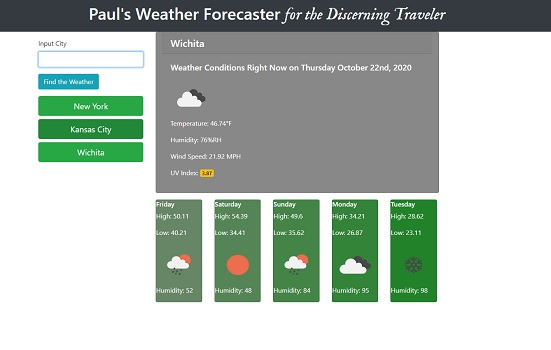

# Paul's Weather Forcaster _for the Discerning Traveler_

Are you more than a simple traveler? Do you wish you could _discern_ what the weather would be in cities you plan to visit? Perhaps you simply wish to amaze your friends with the ability to predict what the weather will be like with moderate accuracy. Whatever the case, this webpage is for you!

## Usage

The first time you use the forecaster, simply type in the name of a city that you wish to know the weather of. It doesn't even matter if you currently reside in the city or not! The cities you are interested in will be saved and can be clicked on at any time to see their weather.

Have no worries about closing the page, your favorite cities will still be remembered! Even if you come back several days later, you will still have up-to-date weather information for all your favorite cities.

## Where to Find it

Paul's Weather Forecaster _for the Discerning Traveler_ can be found [here](https://kirkpatrickpaul.github.io/06_weather_app/). Before you begin, it will look rather plain, but once you get the hang of it, it should look something like this:

